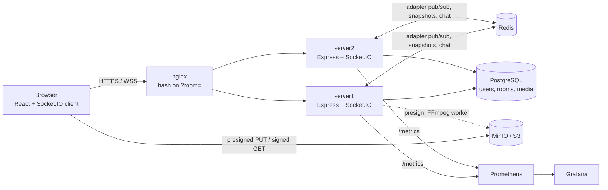

<div align="center">

# 🎬 Watch Party

**Watch videos together, perfectly in sync.**
Create a room, share a 6-character code, and everyone's player stays in lockstep, with roles, live chat, reactions and a moderation-style approval queue.


[Features](#-features) · [Architecture](#-architecture) · [Quick start](#-quick-start) · [Configuration](#-configuration) · [Testing](#-testing) · [Design decisions](#-design-decisions)

</div>

---

## Overview

Watch Party is a full-stack, real-time application for watching video together. A host creates a room, friends join with a short code, and playback (play, pause, seek, video changes) stays synchronized across every device, even with different network latencies.

It is built as a production-style system rather than a demo: a **server-authoritative sync model**, a **single shared permission matrix**, **horizontal scaling** with room-aware load balancing, **observability** (Prometheus + Grafana), automated tests, CI, and a load test.

## ✨ Features

### Synchronized playback
- **Server-authoritative state.** The server stores playback as an anchor `{position, updatedAt, playing}`. Clients derive the current position from a server-synced clock, so each change costs one small message instead of a stream of ticks.
- **NTP-style clock sync.** Each client estimates its offset from the server with 8 ping round trips and keeps the lowest-latency sample.
- **Invisible drift correction.** Drift under ~0.12 s is ignored, up to ~1 s is corrected by nudging `playbackRate` (max ±8%), and anything larger triggers a seek.
- **Late joiners and reconnects** receive a full snapshot and hard-sync instantly.
- **Stale-update protection.** Every state change carries a version number; older updates are discarded.

### Video sources
| Source | How it works |
|---|---|
| **YouTube** | Paste a watch, `youtu.be`, shorts or embed link (or a bare video ID). Played through the YouTube IFrame API. |
| **Uploaded movie** | Browser uploads straight to S3/MinIO via a presigned URL (up to 4 GB), then streams back through a signed URL. Optional FFmpeg transcoding to web-friendly MP4. |
| **Local file** | Every member opens the same file from their own disk. Nothing is uploaded, and playback is still synced. |

### Rooms and identity
- Create or join a room with a **6-character code**.
- **Guest mode** (pick a name) or **registered accounts** (bcrypt-hashed passwords, JWT sessions).
- **Random partner matching:** join a queue and get paired into a room with another waiting user.
- **Roles persist by user ID**, so a page refresh keeps your role, with a 30-second grace period on reconnect.

### Roles, permissions and approvals
| Action | Host | Moderator | Participant |
|---|:-:|:-:|:-:|
| Play / pause / seek / change video | ✅ | ✅ | request only |
| Approve or decline requests | ✅ | ✅ | ❌ |
| Remove a participant | anyone but self | participants only | ❌ |
| Assign roles | ✅ | ❌ | ❌ |
| Transfer host | ✅ | ❌ | ❌ |
| Chat and reactions | ✅ | ✅ | ✅ |

Participants without control rights can **request** a playback change. Hosts and moderators see a live approval queue and approve or reject each request, and the requester is notified of the outcome.

### Chat and reactions
- Live room chat with history (last 100 messages kept in Redis).
- One-tap emoji reactions (👍 ❤️ 😂 😮 🔥 👏) that float over the video for everyone.

### Reliability, security and operations
- **Horizontal scaling:** multiple server nodes behind nginx, rooms pinned to a node by hashing the room code, events fanned out across nodes by the Redis Socket.IO adapter.
- **Graceful draining:** on shutdown `/health` returns 503 and clients are told to reconnect to a healthy node.
- **Security:** Helmet headers, CORS allow-list, Zod validation on every REST body and socket event, stricter rate limits on login and register, signed JWTs, permission checks before any state mutation.
- **Observability:** Prometheus metrics (connected sockets, active rooms, latency, client drift) with a provisioned Grafana dashboard.
- **Quality:** strict TypeScript across all packages, 22 unit and integration tests (real sockets), GitHub Actions CI, and a k6 load test.

## 🏗 Architecture



### How a sync event flows

```mermaid
sequenceDiagram
  participant H as Host
  participant S as Server (room pinned)
  participant R as Redis
  participant V as Viewer
  H->>S: playback:play {position: 12}
  S->>S: assertCan(host, play), apply action
  S-->>H: playback:state {playing, position 12, updatedAt T, v+1}
  S-->>V: playback:state {...}
  S->>R: SET room snapshot
  V->>V: target = 12 + (serverNow - T); seek/play
  loop every 1 s
    V->>V: drift = player.time - target; nudge rate or seek
  end
```

- **REST** handles sign-in, rooms, media presigning and matching. **WebSocket (Socket.IO)** handles everything live.
- **Media never touches the realtime path:** YouTube plays from YouTube, uploads go browser → S3/MinIO, and local files never leave the browser.
- Full write-ups: [docs/architecture.md](docs/architecture.md) · [docs/events.md](docs/events.md) · [docs/diagrams/](docs/diagrams)

### Tech stack

| Layer | Technology |
|---|---|
| Client | React, TypeScript, Vite, Zustand, YouTube IFrame API, HTML5 video |
| Server | Node 20, Express, Socket.IO, Zod, JWT, bcrypt |
| Data | PostgreSQL (users, rooms, media metadata), Redis (snapshots, chat, matching queue, pub/sub) |
| Storage | S3-compatible object storage (MinIO in the stack), optional FFmpeg transcoding |
| Infra | Docker Compose, nginx (WebSocket-aware load balancer), Kubernetes manifests with KEDA autoscaling |
| Observability | Prometheus, Grafana |
| Quality | Vitest, strict `tsc`, GitHub Actions, k6 |

### Project structure

```
shared/   event names, payload types, role matrix, sync math (imported by client and server)
client/   React app: pages, components, player adapters, realtime hooks, stores
server/   Express + Socket.IO; modules/{auth, rooms, realtime, media, matching}
infra/    nginx, prometheus, grafana, k8s (Deployment, Service, Ingress, KEDA)
docs/     architecture, event contract, diagrams
load-tests/   k6 scenario
```

Each server module only imports another module's public functions, so any of them can be split into its own service later. `shared/` is a common package, so renaming an event or changing a payload is a **compile error** on the other side, not a runtime bug.

## 🚀 Quick start

Requires **Node 20+**. Docker is optional.

### A) Zero-setup development

```bash
npm install
npm run dev
```

Open **http://localhost:5173**. The server uses an in-memory Postgres (`pg-mem`) and Redis (`ioredis-mock`), so nothing else needs to be installed. Data resets on restart and uploads are disabled. YouTube and local-file rooms work fully.

**Try it:** open the app in two browser windows (one normal, one private), create a room in the first, and join with the code in the second.

### B) Full stack with Docker

Runs 2 server nodes, nginx, Postgres, Redis, MinIO, Prometheus and Grafana.

```bash
cp .env.example .env        # optional, defaults work locally
docker compose up --build
```

| Service | URL |
|---|---|
| App (nginx: client + API + WebSocket LB) | http://localhost:8080 |
| MinIO console | http://localhost:9001 |
| Prometheus | http://localhost:9090 |
| Grafana dashboard | http://localhost:3001 |

Set `TRANSCODE_ENABLED=true` in `.env` to convert uploads to web-friendly MP4 with FFmpeg (bundled in the server image). To watch room pinning, join the same room from two windows and run `docker compose logs server1 server2`. One node handles the room.

### C) Dev server + MinIO only (uploads without the full stack)

```bash
docker run -d -p 9000:9000 -p 9001:9001 \
  -e MINIO_ROOT_USER=minioadmin -e MINIO_ROOT_PASSWORD=minioadmin \
  pgsty/minio:RELEASE.2026-06-18T00-00-00Z server /data --console-address ":9001"
cp .env.example .env   # set S3_ENDPOINT=http://localhost:9000 S3_ACCESS_KEY=minioadmin S3_SECRET_KEY=minioadmin
npm run dev
```

## ⚙️ Configuration

All settings are environment variables (see [`.env.example`](.env.example)). Empty values are treated as unset.

| Variable | Default | Purpose |
|---|---|---|
| `JWT_SECRET` | dev placeholder | **Required in production.** Min 16 chars. Generate with `openssl rand -hex 32` |
| `JWT_EXPIRES_IN` | `12h` | Token lifetime |
| `CLIENT_ORIGIN` | `http://localhost:5173` | Origin(s) allowed by CORS and Socket.IO (comma-separated) |
| `DATABASE_URL` | empty | PostgreSQL URL. Empty uses in-memory Postgres |
| `REDIS_URL` | empty | Redis URL. Empty uses in-memory Redis (single node only) |
| `S3_ENDPOINT` | empty | Object storage endpoint used by the server. Empty disables uploads |
| `S3_PUBLIC_ENDPOINT` | `S3_ENDPOINT` | Endpoint the **browser** can reach, used for presigned URLs |
| `S3_BUCKET` / `S3_REGION` | `watch-party` / `us-east-1` | Bucket settings |
| `S3_ACCESS_KEY` / `S3_SECRET_KEY` | empty | Storage credentials |
| `TRANSCODE_ENABLED` | `false` | Run FFmpeg after upload |
| `RATE_LIMIT_MAX` | `600` | REST requests per minute per IP |
| `NODE_ID` | `node-<pid>` | Instance label in logs and metrics |
| `VITE_API_URL` | empty | Client API base URL. Empty means same origin |

## 🧪 Testing

| Command | What it does |
|---|---|
| `npm test` | 22 unit and integration tests (real sockets, roles, approvals, matching) |
| `npm run lint` | Strict TypeScript check of `shared`, `server` and `client` |
| `npm run build` | Production client build in `client/dist` |
| `npm run dev` | Server (:4000, watch mode) + client (:5173, proxies `/api` and `/socket.io`) |

CI (GitHub Actions) runs typecheck, tests, the client build and both Docker image builds on every push and pull request.

**Load test** (k6, simulates many rooms with several viewers each):

```bash
RATE_LIMIT_MAX=100000 docker compose up -d
k6 run -e BASE=http://localhost:8080 -e ROOMS=50 -e VIEWERS=3 load-tests/room-sync.k6.js
```

## 🧠 Design decisions

- **Anchor timestamp instead of streaming ticks.** One small message per change, and late joiners compute the correct position immediately.
- **Room pinning.** nginx hashes on `?room=`, so every member of a room hits one node and its in-memory room is the single writer. The Redis adapter still lets events cross nodes if the hash changes, and state survives through the Redis snapshot.
- **One permission matrix** in `shared/`, used by both the UI (to show or hide controls) and the server (to enforce). The UI can never drift from the rules.
- **Zero-setup development.** With no `DATABASE_URL` or `REDIS_URL`, the server uses in-memory stand-ins. The production code paths are identical.
- **Graceful drain.** On `SIGTERM`, `/health` returns 503, clients get `server:draining` and reconnect elsewhere, then the server closes.

### Known limits

- Room state is held per node with no cross-node lock. Pinning by room code avoids conflicts in normal operation.
- Roles and playback live in a Redis snapshot (24 h TTL), not in Postgres.
- REST rate limiting is per node. Swap in `rate-limit-redis` when scaling out.
- Access tokens are single 12 h JWTs. A short-lived access plus refresh token pair is the next step.
- Uploaded files are not virus-scanned.

### What I would change at 100× scale

1. Split the realtime service out and autoscale it on connected sockets (KEDA).
2. Add an event backbone (Kafka or Redis Streams) so media, moderation and analytics react to events independently.
3. Move chat to a wide-row store such as Cassandra or Scylla, keeping only recent messages in Redis.
4. Go multi-region: pin a room to its host's region and replicate only durable data.
5. Serve uploaded movies as HLS segments behind a CDN, with a WAF in front.
6. Use a Redis room lease (`SET NX PX`) so exactly one node owns a room even when the hash ring changes.
7. Add OpenTelemetry tracing and alerts on p95 sync latency and drift.

## 🌐 Deployment

- **Single VM:** install Docker, copy the repo, set a real `JWT_SECRET`, `S3_PUBLIC_ENDPOINT` and `CLIENT_ORIGIN` in `.env`, run `docker compose up -d --build`, and put HTTPS (Caddy or Cloudflare) in front of port 8080.
- **Kubernetes / k3s:** see [`infra/k8s/`](infra/k8s) for the Deployment, Service, Ingress (with room hashing) and a KEDA scaler driven by connected sockets.

## 🛠 Troubleshooting

| Problem | Fix |
|---|---|
| Video won't start, or "Click to join the playback" | The browser blocked autoplay. Click the overlay once |
| Uploads fail in Docker | The browser must be able to reach `S3_PUBLIC_ENDPOINT` (default `http://localhost:9000`) |
| `Room not found` after a dev restart | In-memory Postgres resets on restart. Set `DATABASE_URL` for persistence |
| Port already in use | Change `PORT` (server) or `server.port` in `client/vite.config.ts` |

---

<div align="center">
Built with React, Node.js, Socket.IO, PostgreSQL and Redis.
</div>